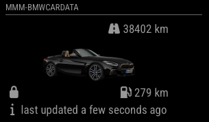

# MMM-BMWCarData
Magic Mirror Module to display data from BMW's Car Data API for your car(s).

**Warning**: very experimental at this moment, and development and testing is primarily focused on my specific use case (single european ICE car).

The module displays icons to show lock, charging and battery status, electric and combined range, and total kilometers driven. It also shows the time the module last received data from BMW's servers.

If you own several BMW cars, you can configure a module for each of them. The module configuration requires the vin number of the car to separate multiple module instances.

The module is heavily based on [MMM-MyBMW](https://github.com/Jargendas/MMM-MyBMW) by [Jargendas](https://github.com/Jargendas) which used the MyBMW API, which is not accessible anymore. It is mostly a re-write of the back end to support obtaining the data from BMW's CarData interface.

## Requirements

## Installation

Clone this repository in your modules folder, and install dependencies:

    cd ~/MagicMirror/modules
    git clone https://github.com/drdude684/MMM-BMWCarData.git
    cd MMM-BMWCarData
    npm install 

## Configuration

Obtain a BMW CardData client ID as per [BMW's instructions](https://bmw-cardata.bmwgroup.com/customer/public/api-documentation). Ensure 'request access to CarData API' is enabled for that client ID.
Go to the MagicMirror/config directory and edit the config.js file. Add the module to your modules array in your config.js.

Enter these details in the config.js for your MagicMirror installation:

        {
            module: "MMM-BMWCarData",
            position: "top_right",
            config: {
                clientId: "QQQQQQQQQQQQQQQQQQQQQQQ",
                vin: "XXXXXXXXXXXXXXXXX",
            }
        },

## Module configuration
The module has a few configuration options:

<table>
  <thead>
    <tr>
      <th>Option</th>
      <th>Description</th>
    </tr>
  </thead>
  <tbody>
    <tr>
      <td><code>clientId</code></td>
      <td>Your Client ID for the BMW CarData API, required.  <strong>Default: </strong><code>undefined</code></td>
    </tr>
    <tr>
      <td><code>vin</code></td>
      <td>Your car's VIN code, required.  <strong>Default: </strong><code>undefined</code></td>
    </tr>
    <tr>
      <td><code>refresh</code></td>
      <td>How often to refresh the data in minutes.    Be careful: BMW limits the amount of calls per account per day (to 50), so don't set this value too low.  <strong>Default: </strong><code>60</code></td>
    </tr>
    <tr>
      <td><code>vehicleOpacity</code></td>
      <td>The opacity of the car image. Between 0 and 1.  <strong>Default: </strong><code>0.75</code></td>
    </tr>
    <tr>
      <td><code>useUSUnits</code></td>
      <td>If true, miles instead of kilometres are shown for all range values. (implementation incomplete/untested/maybe not required)  <strong>Default: </strong><code>false</code></td>
    </tr>
    <tr>
      <td><code>showMileage</code></td>
      <td>Whether to show the mileage.   <strong>Default: </strong><code>true</code></td>
    </tr>
    <tr>
      <td><code>showElectricRange</code></td>
      <td>Whether to show the electric range. Will be hidden automatically if electric range is zero (i.e. when car is not electric). (implementation incomplete/untested)  <strong>Default: </strong><code>true</code></td>
    </tr>
    <tr>
      <td><code>showElectricPercentage</code></td>
      <td>Whether to show the battery charging also in percentages. Will be hidden automatically if electric range is zero (i.e. when car is not electric). (implementation incomplete/untested)  <strong>Default: </strong><code>true</code></td>
    </tr>
    <tr>
      <td><code>showFuelRange</code></td>
      <td>Whether to show the fuel range. Will be hidden automatically if fuel range is zero (i.e. when car is  electric).   <strong>Default: </strong><code>true</code></td>
    </tr>
    <tr>
      <td><code>showLastUpdated</code></td>
      <td>Whether to show the info when the data was last updated.   <strong>Default: </strong><code>true</code></td>
    </tr>
    <tr>
      <td><code>lastUpdatedText</code></td>
      <td>The text to be shown before the last updated timestamp.   <strong>Default: </strong><code>last updated</code></td>
    </tr>
  </tbody>
</table>

## Changelog

**2024-12-24** Pushed first version which fully works for my car. 
**2024-12-22** Forked from MMM-MyBMW and migrated to BMW CarData API. 
